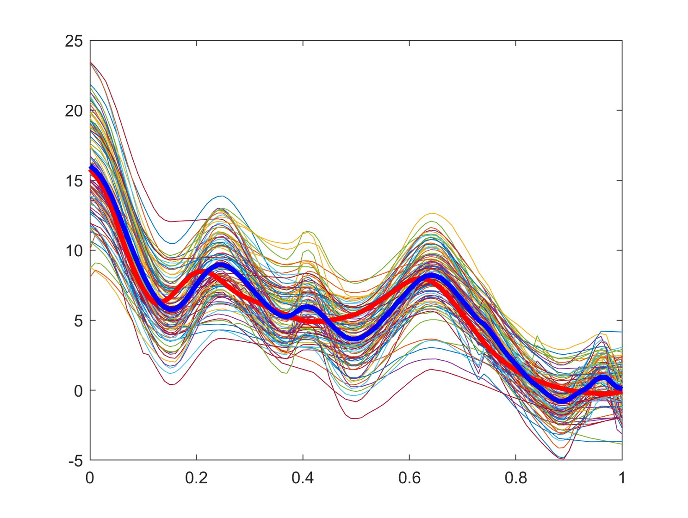
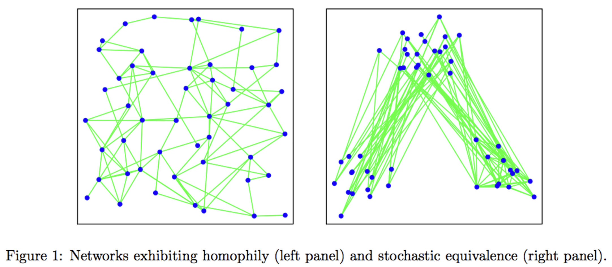

<h2 id="research">RESEARCH INTEREST</h2>

Functional Data Anaylsis ⏐ Functional Registration ⏐ Bayesian Statistics ⏐ Generative Models (VAEs)

<h2 id="projects">PROJECTS</h2>

<h3 id="fda">■ Functional Data Analysis (Functional Registration)</h3>
Functional data — curves, shapes, and other complex structures — arise in fields like biology, medicine, and the social sciences, where understanding dynamic patterns is critical.
Functional Data Analysis (FDA) provides a framework for modeling these datasets, offering tools to uncover meaningful structure and variability. However, in many real-world applications, functional data are noisy, misaligned, and highly complex, posing challenges even for FDA.

My primary research focuses on **functional registration** — or alignment — using the Fisher-Rao metric within a <a href="https://en.wikipedia.org/wiki/Riemannian_manifold">Riemannian manifold</a> framework. To understand functional registration, it is important to recognize that functional data typically exhibit two types of variation:
- Phase variation: temporal shifts of a function.
- Amplitude variation: changes in magnitude of a function.

Functional registration primarily addresses phase variation — temporal misalignment among functions — by aligning them in a geometrically meaningful way.

Consider a smooth function, $f(t)$, defined on the interval $[0,1]$, where $t$ represents time.

- The left plot: a warping function $\gamma(t)$.
- The right plot: the function after time warping, $f(\gamma(t))$.

You can explore these ideas with the interactive plot below. 

(Drag the red points to see how $\gamma(t)$ warps $f(t)$.)

  <iframe 
    src="misc_pages/warping.html" 
    width="500" 
    height="350"
    style="border:0px solid black;
    display: block;">
  </iframe>

Functional registration is particularly important when phase variation is present.
When functions are generated from a common underlying signal with phase variability, the cross-sectional mean of the unregistered functions can be severely biased.
Correcting phase variation enables more accurate and robust statistical analysis.

A straightforward approach is to minimize $\mathbb{L}^2$ distances directly among functions, but the $\mathbb{L}^2$ metric is not invariant under time warping, making it unsuitable for phase alignment.
In contrast, the Fisher-Rao metric is invariant to warping transformations, providing a consistent framework for registration.

To address the computational challenges of Fisher-Rao metric, <a href="https://doi.org/10.1109/TPAMI.2010.184" target="_blank">Srivastava et al. (2011)</a> introduced the Square Root Velocity Function (SRVF) representation, where the standard $\mathbb{L}^2$ metric corresponds exactly to the Fisher-Rao distance, enabling efficient and principled computation.

<h4 id="ppd">▫ Peak Persistence Diagrams (<a href="https://github.com/wk45/PPD">PPD</a>)</h4>

In practice, functional data often arise as noisy, discretized measurements that are later smoothed to approximate continuous curves. To preserve important features like peaks and valleys, practitioners typically avoid aggressive smoothing, which leaves small residual fluctuations in the data.
  
These minor fluctuations pose a challenge when applying <a href="https://en.wikipedia.org/wiki/Dynamic_time_warping">dynamic time warping</a> (DTW) combined with the Fisher-Rao metric for alignment. Because the Fisher-Rao framework seeks to minimize geodesic distance precisely, it can be overly sensitive to noise, resulting in over-alignment where the warping function matches even insignificant variations.

<!--  -->
  
To mitigate over-alignment in such cases, practitioners often introduce penalty terms — but selecting appropriate penalties remains an open and challenging problem. To address this limitation, we propose a simple yet effective visual tool: the Peak Persistence Diagram (PPD).
PPD helps identify and summarize significant internal peaks in functional data, offering robustness to noise while remaining sensitive to meaningful structural patterns.

 
<!-- #### • Phase Alignment of functions via [Trajectory Analysis](/Projects/PathAnalysis/Visualization/test99.html)
Functional registration is accomplished by analyzing the trajectory of the mean function after alignment. This is done by projecting the aligned functions onto a lower-dimensional space using Functional Principal Component Analysis (FPCA), enabling effective visualization and interpretation of the registration process. -->

<h4 id="bayes">▫ Bayesian Functional Alignment (on-going)</h4>

We addressed the challenge of functional registration under noisy and misaligned data by developing a more robust solution within a Bayesian framework.
  
Classical optimization-based methods such as DTW find a global optimal warping path, so they are often highly sensitive to noise and outliers. In contrast, the Bayesian framework offers several key advantages:
it provides a probabilistic solution by modeling the full posterior distribution of warping functions;
it allows prior information to be naturally incorporated into the registration process;
and it can capture multiple modes in the posterior distribution, enabling exploration of multiple plausible warping solutions — a flexibility that traditional optimization-based methods cannot offer.
  
We have successfully <strong> successfully developed a Bayesian method</strong> for functional registration and signal estimation under noisy and time-warped data, providing greater robustness to noise by moving beyond the traditional Fisher-Rao framework.

 

<h3 id="others"> ■ Other Projects than Functional Data </h3>

<h4 id="network"> ▫ Network Analysis via Bayesian Method (<a href="/Projects/HLSVD/HSVD.pdf">Hierarchical Latent SVD Model</a>) </h4>

In social network data analysis, latent space models (LDMs) are widely used to uncover underlying structures among nodes by embedding them in a latent space. These models can capture various relational metrics—such as distances, classes, and clusters—that facilitate further statistical analysis. Among the different types of LDMs, <a href="https://doi.org/doi:10.48550/arXiv.0711.1146">Hoff (2008)</a> introduced an eigenmodel-based latent space to account for <em>homophily</em>, the tendency of similar nodes to connect.

  

> Homophily helps explain common patterns in social networks, including transitivity (“a friend of a friend is a friend”), balance (“the enemy of my friend is an enemy”), and the formation of cohesive subgroups of nodes” (Hoff 2008).

The goal of this project is to apply <strong>Bayesian hierarchical modeling</strong> to a more general class of latent space models—specifically, the latent SVD model—to induce a shrinkage effect and improve parameter estimation by borrowing strength across the network structure.

 
<h4 id="tda"> ▫ Topological Feature Extraction with Human Brain Connectome</h4>

    We explored how topological data analysis can simplify and reveal structural patterns within complex brain connectivity data. Using multi-level white matter tractography datasets, we applied <a href="https://en.wikipedia.org/wiki/Persistent_homology">persistent homology</a> — a method that captures topological features such as loops and voids across different scales — to better understand the organization of the human brain connectome. The analysis was implemented in R with computational support from <a href="https://github.com/Ripser/ripser">Ripser</a>, a fast and efficient tool for computing persistence diagrams.

